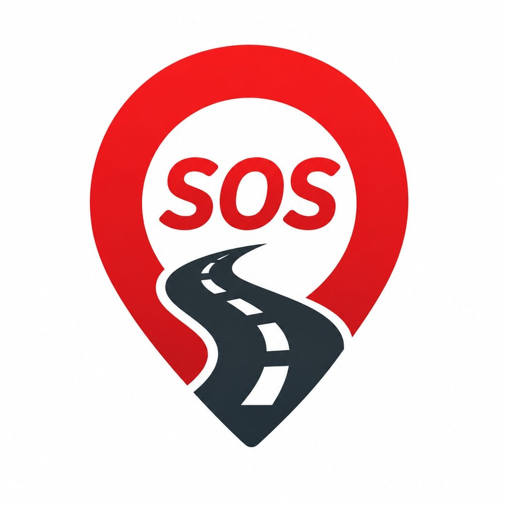

<p align="center">
  
</p>

<h1 align="center">🚨 RoadSOS</h1>
<p align="center"><strong>Smart Roadside Emergency Assistance App</strong></p>
<p align="center">
  <em>Every second counts. RoadSOS makes them count for you.</em>
</p>

<p align="center">
  
  
  
  
</p>

---

## 📖 About

**RoadSOS** is a cross-platform mobile application designed to provide **instant emergency assistance during road accidents**. It combines one-tap SOS alerts, automatic crash detection, real-time nearby service discovery, and offline capability to ensure help is always within reach — even in areas with poor or no connectivity.

---

## ✨ Features

| Feature | Description |
|---------|-------------|
| 🆘 **One-Tap SOS** | Sends SMS with live GPS coordinates to all saved emergency contacts and auto-dials the national emergency number (112) after a 60-second countdown |
| 🚗 **Crash Detection** | Monitors accelerometer data in Journey Mode. Detects G-force spikes (>2.5G) and triggers a 15-second countdown with voice alert before auto-sending SOS |
| 🗺️ **Nearby Services** | Discovers Hospitals, Ambulance, Police, Repair Shops, Towing, Pharmacy & Fuel Stations within 10–15 km using the OpenStreetMap Overpass API |
| 📍 **Interactive Map** | Leaflet-powered map with custom markers, popups with call/navigate actions, and user location tracking |
| 📴 **Offline Mode** | Download map tiles & service data for a 50 km radius using LocalForage (IndexedDB). App stays functional without internet |
| 🔊 **Voice Alerts** | Text-to-Speech notifications on SOS activation and crash detection via Capacitor TTS (native) with Web Speech API fallback |
| 🩹 **First Aid Guide** | Step-by-step emergency procedures — Scene Safety, CPR, Bleeding Control, Spine Injury, Vehicle Fire — accessible offline |
| 👥 **Emergency Contacts** | Save trusted contacts who automatically receive location-tagged SOS messages during emergencies |
| 🌍 **Global Coverage** | Works worldwide via OpenStreetMap. Auto-detects country for correct emergency numbers |

---

## 🛠️ Tech Stack

| Layer | Technology | Purpose |
|-------|-----------|---------|
| Frontend | React 19 + Vite 8 | Component-based SPA with HMR |
| Styling | Vanilla CSS + Lucide Icons | Glassmorphism UI with professional iconography |
| Maps | Leaflet + OpenStreetMap | Interactive maps with custom markers & offline tiles |
| Location | Capacitor Geolocation | Two-phase GPS: fast network fix → GPS satellite refinement |
| Services API | Overpass API (OSM) | Real-time queries for emergency services |
| Offline Storage | LocalForage (IndexedDB) | Cached map tiles and POI data |
| Voice | Capacitor Text-to-Speech | Native TTS on Android/iOS with web fallback |
| Platform | Capacitor 8 | Single codebase → Android APK + Web PWA |
| Geocoding | Nominatim (OSM) | Reverse geocoding for location display |

---

## 📁 Project Structure

```
RoadSOS/
├── android/                  # Capacitor Android project
├── public/                   # Static assets (logo, icons)
├── src/
│   ├── components/
│   │   ├── BottomNav.jsx     # Bottom navigation bar
│   │   ├── LocationGuard.jsx # Location permission handler
│   │   └── MapView.jsx       # Leaflet map with offline tile support
│   ├── hooks/
│   │   ├── useAutoSync.js    # Background offline data sync
│   │   └── useLocation.js    # Two-phase GPS location hook
│   ├── pages/
│   │   ├── Home.jsx          # Main dashboard with SOS, actions, crash detection
│   │   ├── Nearby.jsx        # Nearby services (map + list view)
│   │   ├── FirstAid.jsx      # First aid guide with accordion UI
│   │   └── Contacts.jsx      # Emergency contacts management
│   ├── services/
│   │   ├── geoapify.js       # Geoapify API integration
│   │   ├── offlineManager.js # Map tile & POI caching with LocalForage
│   │   ├── ors.js            # OpenRouteService integration
│   │   └── overpass.js       # Overpass API (OSM) for service discovery
│   ├── utils/
│   │   ├── offlineDb.js      # Offline database helpers
│   │   └── places.js         # Place processing & emergency contacts
│   ├── App.jsx               # Root component with routing
│   ├── config.js             # API keys and configuration
│   ├── index.css             # Global styles
│   └── main.jsx              # App entry point
├── capacitor.config.json     # Capacitor configuration
├── vite.config.js            # Vite build configuration
└── package.json
```

---

## 🚀 Getting Started

### Prerequisites

- [Node.js](https://nodejs.org/) (v18 or later)
- [Android Studio](https://developer.android.com/studio) (for Android builds)

### Installation

```bash
# Clone the repository
git clone https://github.com/VidhyaSriKS/RoadSOS.git
cd RoadSOS

# Install dependencies
npm install

# Start the development server
npm run dev
```

The app will be available at `https://localhost:5173/`

### Android Build

```bash
# Build the web app
npm run build

# Sync with Capacitor
npx cap sync android

# Open in Android Studio
npx cap open android
```

---

## 📱 Pages Overview

### 🏠 Home
- Prominent SOS button with animated rings
- Quick-access grid: Hospitals, Ambulance, Police, Repair, Towing, Pharmacy, Fuel, First Aid
- Journey Mode toggle for crash detection
- Offline region download
- GPS status with cached location fallback

### 🗺️ Nearby Services
- Category filter strip (7 service types)
- Toggle between Map View and List View
- Service cards with distance, call, and navigate buttons
- Offline mode indicator with cached data

### 🩹 First Aid
- 7 emergency scenarios with collapsible step-by-step instructions
- Quick-dial emergency numbers (112, 108, 100, 101, 1033)

### 👥 Contacts
- Add/remove emergency contacts
- Test SOS messaging to all saved contacts
- Contacts receive GPS-tagged SMS during emergencies

---

## 🌐 APIs Used

| API | Purpose |
|-----|---------|
| [Overpass API](https://overpass-api.de/) | Query OpenStreetMap for nearby services (hospitals, police, ambulance, repair, towing, pharmacy, fuel) |
| [Nominatim](https://nominatim.openstreetmap.org/) | Reverse geocoding — convert GPS coordinates to city/country |
| [OpenStreetMap Tiles](https://tile.openstreetmap.org/) | Map tile rendering with offline caching support |

---

## 📴 Offline Capabilities

RoadSOS is designed to function in low/no connectivity scenarios:

- **Map Tiles**: Download and cache tiles for a 50 km radius around your location (zoom levels 12–15)
- **Service Data**: POI data is cached via LocalForage and served from IndexedDB when offline
- **Auto-Sync**: Background hook (`useAutoSync`) automatically refreshes cached data when connectivity is restored
- **Location Fallback**: Falls back to last known GPS coordinates when satellite fix is unavailable
- **Visual Indicator**: Offline mode banner appears automatically to inform the user

---

## 🔮 Future Scope

- 📡 **Live Accelerometer Integration** — Replace simulated data with real device sensors
- 📍 **Real-Time Location Sharing** — Continuous GPS tracking shared with emergency contacts
- 🚧 **Community Alerts** — Crowdsourced road hazard and accident reporting
- ⌚ **Wearable Integration** — Smartwatch companion for hands-free SOS
- 🤖 **AI Crash Severity Analysis** — Sensor fusion to estimate crash severity
- 🌐 **Multi-Language Support** — Localized UI and voice alerts for regional languages

---

## 📄 License

This project is developed for academic purposes.

---

<p align="center">
  Made with ❤️ for safer roads
</p>
